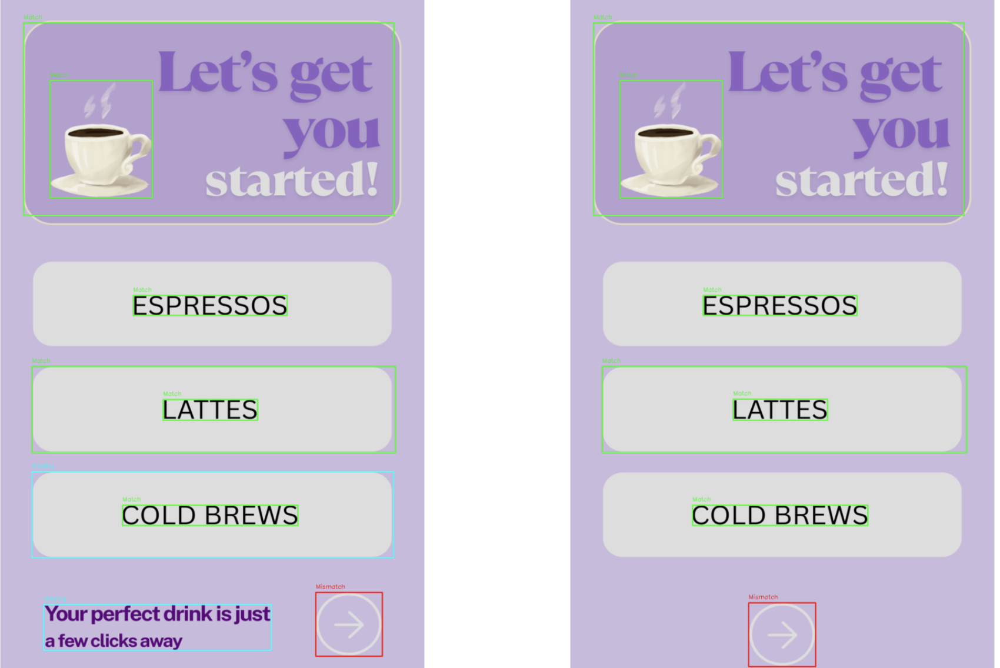
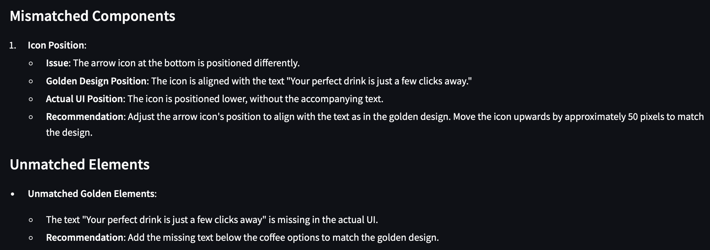

# 🧠 Diffy: AI-Powered UI Mismatch Detection Tool


**Automated UI testing made smart — with CV, LLMs, and explainability.**

Diffy automates the comparison between golden/reference UI screenshots and actual implementations. It detects and explains mismatches using multimodal embeddings, OCR, heuristics, and GPT-4o-powered natural language reasoning — streamlining the UI validation process for developers and QA engineers.

---

## 🚀 Demo Video & Live Pitch

📽️ [60-second demo video](https://drive.google.com/file/d/1G55l4D3xn2-Kune8iwAdB7zTYKc4b_Zy/view?usp=share_link)  
🧾 [Pitch Deck Presentation](https://drive.google.com/file/d/1974yOp8ihOkFINzDCCO99vyEypU_8J9H/view?usp=share_link)  
📑 [Full Project Report PDF](https://drive.google.com/file/d/1ixqT2REAk5_nsJdXZkuHcQ5PXb5Xy5jc/view?usp=share_link)


---

## 🧩 Features

- 🧠 **LLM-powered mismatch explanations** (via GPT-4o)
- 🧾 **Semantic-aware matching** using fused multimodal embeddings
- 🔍 **Mismatch classification**: text, visual, position, missing, class
- 🕵️ **Fine-grained heuristics** for explainable deltas
- 📦 **JSON reports** for integration into CI/CD
- 🖼️ **Streamlit UI** with bounding box overlays
- 💡 **Dark/light mode detection**
- 🔤 **OCR layer** for embedded text
- 📈 **Hybrid visual + spatial + textual analysis**

---

## 🔍 Output Preview : Example
- **Mismatch detection**: understands positional issues and missing components

- **Explainability**: provides natural language explanations for detected mismatches


## 🛠️ Tech Stack

| Component            | Tech / Tool                                      |
|----------------------|--------------------------------------------------|
| UI Element Detection | Roboflow-trained Object Detection                |
| OCR & Screen Context | Tesseract + Pix2Struct                           |
| Embedding Models     | CLIP, Sentence-BERT, Custom Fused Representations|
| Alignment Algorithm  | Hungarian Algorithm (Graph-based Matching)       |
| Explainability       | OpenAI GPT-4o via Python SDK                     |
| Frontend             | Streamlit                                        |
| Scripting / Logic    | Python                                           |
| Visualization        | Streamlit Canvas / Image Overlays               |
| Reporting            | JSON, CSV                                        |


## ⚙️ How to Set Up & Run Locally

### 1. Clone the Repo

```bash
git clone https://github.com/avishi-sreenidhi/diffy-ui-validator.git
cd diffy-ui-validator
```

### 2. Create and Activate a Virtual Environment (Optional but Recommended)

```bash
python3 -m venv diffyenv
source diffyenv/bin/activate  # On Windows: diffyenv\Scripts\activate
```

### 3. Install Dependencies

```bash
pip install -r requirements.txt
```

### 4. Set Up API Keys

This project uses GPT-4o and other LLM APIs. Make sure to set your environment variables:

```bash
# In terminal or .env file (if using python-dotenv)
export OPENAI_API_KEY=your_key_here
```

### 5. Run the Streamlit App

```bash
streamlit run app.py
```

> Upload your **golden screenshot** and **actual UI screenshot** — Diffy will do the rest ✨


